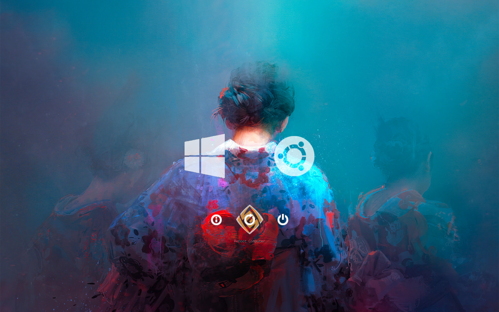

# Samurai-style rEFInd theme




## Installation

1. Clone this repo.
2. Remove unnecessary files i.e `.git` folder.
3. Figure out your refind directory. It should be `/boot/efi/EFI/refind`.
4. Create a folder named `themes` inside there.
5. Move `rEFInd-theme` into `themes`.
6. Open `/boot/efi/EFI/refind/refind.conf`.
7. Add `include themes/rEFInd-theme/theme.conf` at the end of the file.  
8. Change boot order in BIOS to boot with rEFInd on default.
9. (Optional) Remove extra boot options from refind (such as fallback and grub) and lower time to choose the system you want to boot into.
10. (Fix) For me rEFInd shows Windows 8 logo when i have Windows 10 installed so I added a little fix by changing the icons.

**TLDR;**  
You can use this short shell script although it is not guaranteed to work correctly.
```
git clone https://github.com/pabello/rEFInd-theme.git
rm -rf rEFInd-theme/.git rEFInd-theme/README.md rEFInd-theme/preview
sudo mkdir /boot/efi/EFI/refind/themes
sudo mv rEFInd-theme /boot/efi/EFI/refind/themes/rEFInd-theme
sudo sed -Ei.bak 's/(timeout) ([0-9]*)/\1 10/' /boot/efi/EFI/refind/refind.conf
echo -e '\n# Remove unwanted boot options\ndont_scan_files shim.efi,MokManager.efi,shimx64.efi,mmx64.efi,grubx64.efi,bootx64.efi,fbx64.efi' | sudo tee -a /boot/efi/EFI/refind/refind.conf
echo -e '\n# Use custom rEFInd theme\ninclude themes/rEFInd-theme/theme.conf' | sudo tee -a /boot/efi/EFI/refind/refind.conf

# Icon changing (backup included)
sudo mv os_win8.png os_win8.png.bak && sudo cp os_windows.png os_win8.png
```

## Attribution
OS icons from [refind-ambience](https://github.com/lukechilds/refind-ambience)  
Selection icons from [rEFInd-theme-Genshin-Impact](https://github.com/Wooniety/rEFInd-theme-Genshin-Impact)  
Background by [Thomas Dubois](https://www.artstation.com/thomas_dubois)
